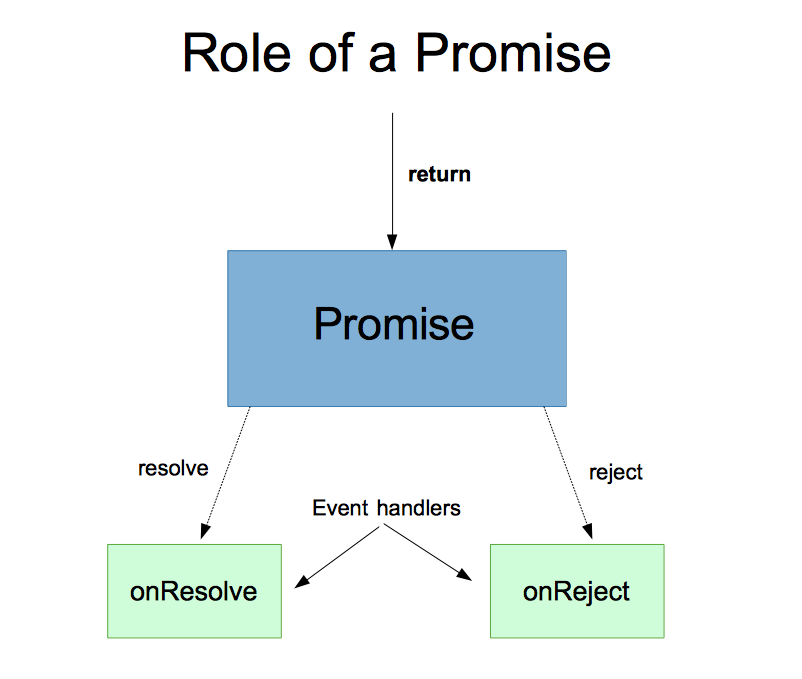
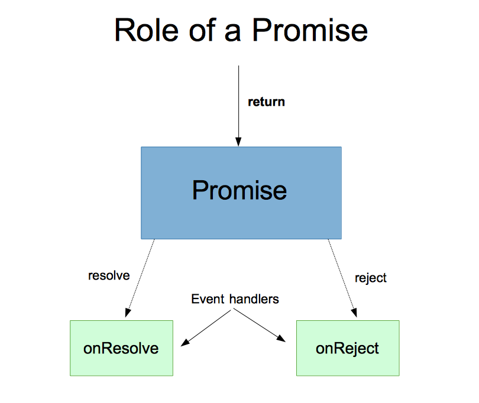

# wdi_11_javascript_promises

### Introduction

Welcome to the Promise land! (sorry) You have been sneakily using promises this whole class, but today, we will illuminate what exactly a promise is, and shed light on best practices to use while playing with promises.

### Objectives:

* Describe the anatomy of a Promise
* Utilize Promises to manage asynchronous operations
* Correctly chain Promises on each other
* Handle errors while working with Promises

### Why Promises?

Promises are an alternative to using callbacks that allow us to preserve some asynchronous functionality in our code. Promises create the illusion of returning values or throwing errors from within our callbacks. Promises do not replace callbacks. Promises depend on callbacks, but provide a layer of abstraction between you and callbacks.

### Anatomy of a Promise



### Role of a Promise



### Using a promise

A Promise takes an anonymous function with two parameters; resolve and reject. These callbacks work much like the `next` and `done` callbacks that we encountered will Express handlers and Async functions respectively. The Promise resolves when `resolve` is called, and is rejected when `reject` is called. These two functions can be named whatever you want them to be named. The first parameter will map to `resolve` and the second parameter will map to `reject`.

### .catch and it's uses

`.catch` is a method that gets chained onto a Promise object. It is an error handler. It takes one parameter; a function. This function should have one parameter; a placeholder for an error.

## Labs 1 & 2

Go to our special web page and open the developer console.
Test that the page script is loaded with this snippet:

```javascript
if(!window.lab) {
  alert('Problem.');
}
```

Provide handler signatures.

`lab.one` contains a canned promise that will resolve. Call its then method with a handler to print its result.

`lab.two` contains a canned promise that will reject. Call its catch method with a handler to print its result.

## Group Activity

Pair with the person next to you. One of you writes code to create a Promise. The other writes code to operate on the promise.

At least one of each:
* then
* catch

### More `then` and `catch`

Promises allow us to reclaim the `return` and `throw` keywords. We can return a value from our `then` handler, and that value will be used to fulfill the Promise returned by `then`. It will be available as a parameter to the following then handler.

We can throw errors from our `then` handler, and they will be used to reject the Promise returned by `then`. It will be available as a parameter to the nearest catch handler down the chain.

### Arrays of Promises

A tricky aspect of Promises is iterating over an array of them. Looping doesn't work.

Enter `Promise.all`.

Think of it like `async.parallel`. It lets you provide a handler to be called once all async functions have finished. `Promise.all` collapses an array of Promises into a single Promise, which resolves once all its constituent Promises have resolved.

… but what if you're not waiting for them all to finish? `Promise.race` collapses an array of Promises into a Promise as well, but this one resolves once the first constituent Promise resolves.

## Labs 3 & 4

Call `Promise.all` on the array contained in `lab.three`, then compute the mean of the numeric results.

Call `Promise.race` on the array contained in `lab.four`, then log the numeric result.
